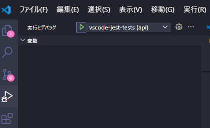

# VSCodeでJest環境構築

VSCodeのJest拡張機能は、標準の方法だとモノレポ構造で利用できないため、マルチルートワークスペースを使って利用する。

## 参考URL

VSCodeのJest拡張機能をmonorepo構成で使いたい[https://qiita.com/uenok0108/items/0c2865e5540046a120fa]

Next.js + TypeScript + Jestでテストを実行できる環境を構築する[https://qiita.com/masakiwakabayashi/items/204ed2b32254bbc9a5c1]

## ステップ

### 1. マルチルートワークスペース用のファイルの作成

`.code-workspace`

```code-workspace
{
  "folders": [
    {
      "name": "root",
      "path": "."
    },
    {
      "name": "web",
      "path": "apps/web"
    },
    {
      "name": "api",
      "path": "apps/api"
    }
  ],
  "settings": {
    "jest.autoRun": "off",
    "jest.jestCommandLine": "npm run test",
    "jest.disabledWorkspaceFolders": [
      "root"
    ]
  }
}
```

### 2. BreakPoint を利用したデバッグに対応させる

#### web (Next.js)

##### launch.json(web) を作成

`apps/web/.vscode/launch.json`

```json
{
  "configurations": [
    {
      "type": "node",
      "name": "vscode-jest-tests",
      "request": "launch",
      "program": "${workspaceFolder}/../../node_modules/.bin/jest",
      "args": [
        "--runInBand",
        "--watchAll=false"
      ],
      "cwd": "${workspaceFolder}",
      "console": "integratedTerminal",
      "internalConsoleOptions": "neverOpen",
    }
  ]
}
```

##### 必要なパッケージをインストール

```bash
npm i -D -w apps/web jest jest-environment-jsdom @testing-library/react @testing-library/jest-dom
npm i -w apps/web ts-jest @types/jest
```

- jest.config.ts を作成

`apps/web/jest.config.ts`

```ts
import type { Config } from 'jest';

const config: Config = {
  preset: 'ts-jest',
  testEnvironment: 'jsdom',
  moduleNameMapper: {
    '\\.(css|less|sass|scss)$': 'identity-obj-proxy',
  },
  transform: {
    '^.+\\.(ts|tsx)$': 'ts-jest',
    '^.+\\.(js|jsx)$': ['babel-jest', { presets: ['next/babel'] }],
  },
  globals: {
    'ts-jest': {
      tsconfig: {
        jsx: 'react-jsx',
      },
    },
  },
};

export default config;
```

##### tsconfig.json を編集

`apps/web/tsconfig.json`

```json
  "exclude": [
    "node_modules",
    "**/*.test.ts",
    "**/*.test.tsx"
  ]
```

##### .eslintignore を編集

`apps/web/.eslintignore`

```.eslintignore
# test
**/*.test.ts
**/*.test.tsx
```

##### package.json を編集

`apps/web/package.json`

```json
"scripts": {
  "test": "jest"
}
```

#### api (NestJS)

##### launch.json(api) を作成

`apps/api/.vscode/launch.json`

```json
{
  "configurations": [
    {
      "type": "node",
      "name": "vscode-jest-tests",
      "request": "launch",
      "program": "${workspaceFolder}/../../node_modules/.bin/jest",
      "args": [
        "--runInBand",
        "--watchAll=false"
      ],
      "cwd": "${workspaceFolder}",
      "console": "integratedTerminal",
      "internalConsoleOptions": "neverOpen",
    }
  ]
}
```

### デバッグ方法

BreakPointを設定後、実行とデバッグからデバッグを起動する



### test コマンドを準備

`package.json`

```json
  "scripts": {
    "----TEST SECTION----": "-------------------------",
    "test": "turbo test",
```

`turbo.json`

```json
  "pipeline": {
    "test": {
      "dependsOn": ["^test"]
    },
```
